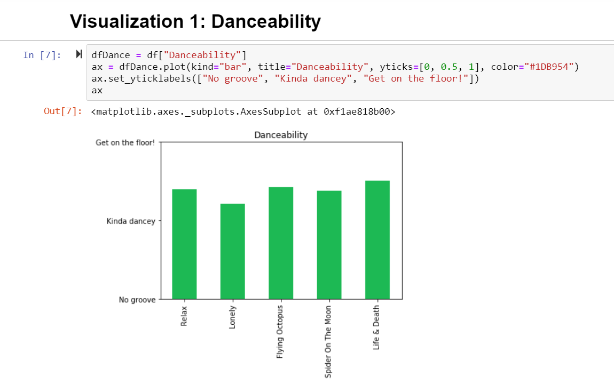
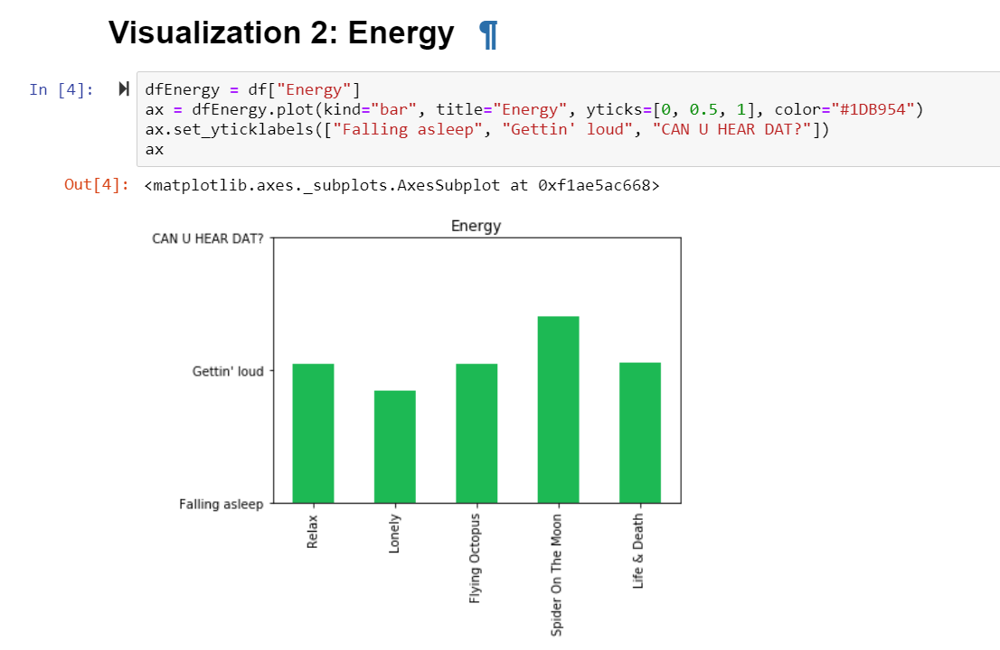
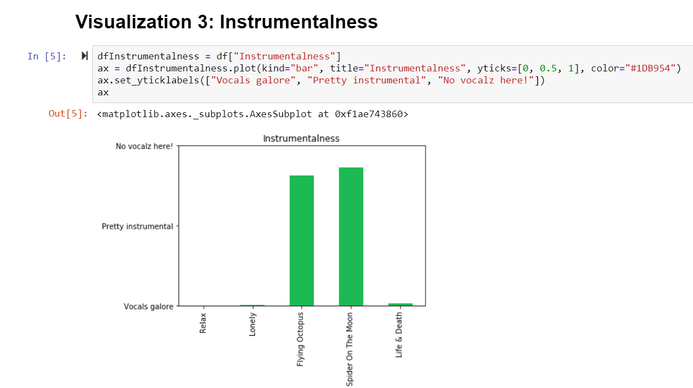
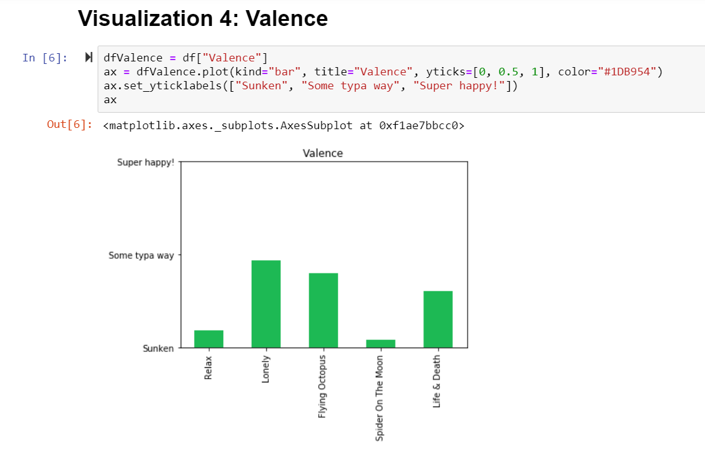

# Tune Viz

Visualizations for Rezz's top Spotify tracks focused on audio features

Technologies used:

- Spotify API
- Python
- Jupyter Notebook
- Matplotlib
- Pandas

## Tune Viz Overview

- Identify what types of audio features **Rezz**'s top 5 tracks have
- Are they all Danceable? Energetic? Instrumental? Positive sounding?

According to Spotify:

- **Danceability**  
  Describes how suitable a track is for dancing based on a combination of musical elements including tempo, rhythm stability, beat strength, and overall regularity. A value of 0.0 is least danceable and 1.0 is most danceable.

* **Energy**  
  A measure from 0.0 to 1.0 and represents a perceptual measure of intensity and activity. Typically, energetic tracks feel fast, loud, and noisy. For example, death metal has high energy, while a Bach prelude scores low on the scale. Perceptual features contributing to this attribute include dynamic range, perceived loudness, timbre, onset rate, and general entropy.

- **Instrumentalness**  
  Predicts whether a track contains no vocals. “Ooh” and “aah” sounds are treated as instrumental in this context. Rap or spoken word tracks are clearly “vocal”. The closer the instrumentalness value is to 1.0, the greater likelihood the track contains no vocal content. Values above 0.5 are intended to represent instrumental tracks, but confidence is higher as the value approaches 1.0.

* **Valence**  
  A measure from 0.0 to 1.0 describing the musical positiveness conveyed by a track. Tracks with high valence sound more positive (e.g. happy, cheerful, euphoric), while tracks with low valence sound more negative (e.g. sad, depressed, angry).

**Tune Viz visualizes these audio features for Rezz's top 5 tracks:**

1. Relax
2. Lonely
3. Flying Octopus
4. Spider On The Moon
5. Life & Death

**Note, if repo is cloned, the code in the Jupyter Notebook will not run properly as the app secret has not been pushed to GitHub so the Spotipy client will fail to connect. Until deployment, please refer to screenshots below for the visualizations**

# Visualization 1: Danceability

# Visualization 2: Energy

# Visualization 3: Instrumentalness

# Visualization 4: Valence

